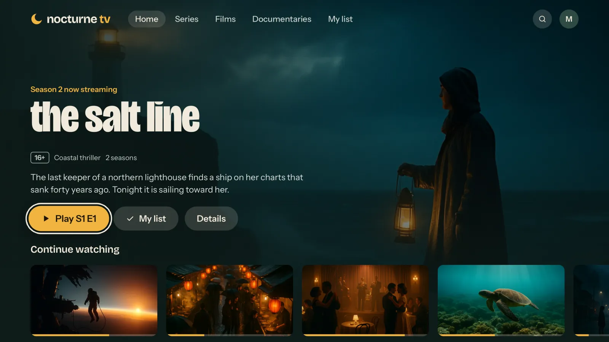
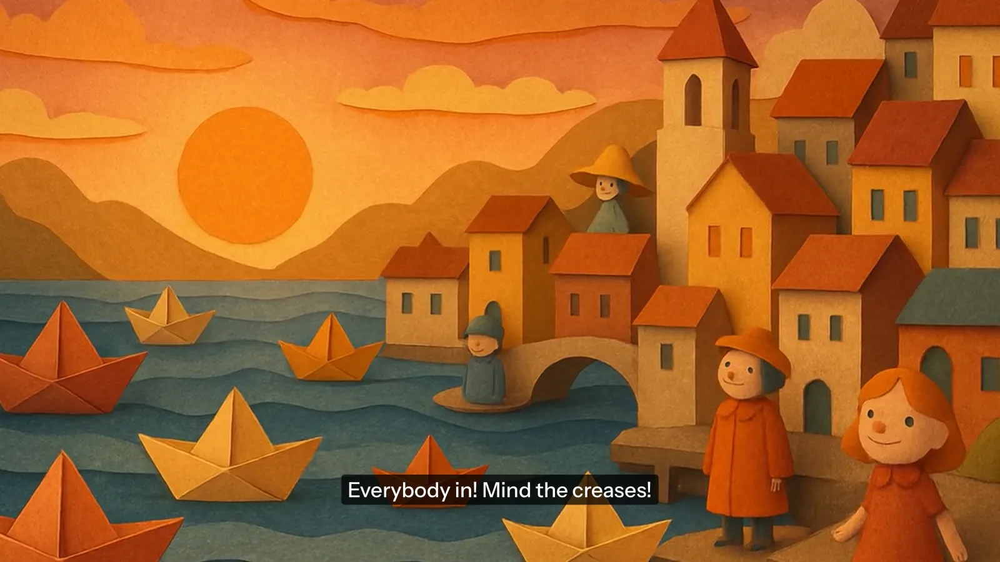
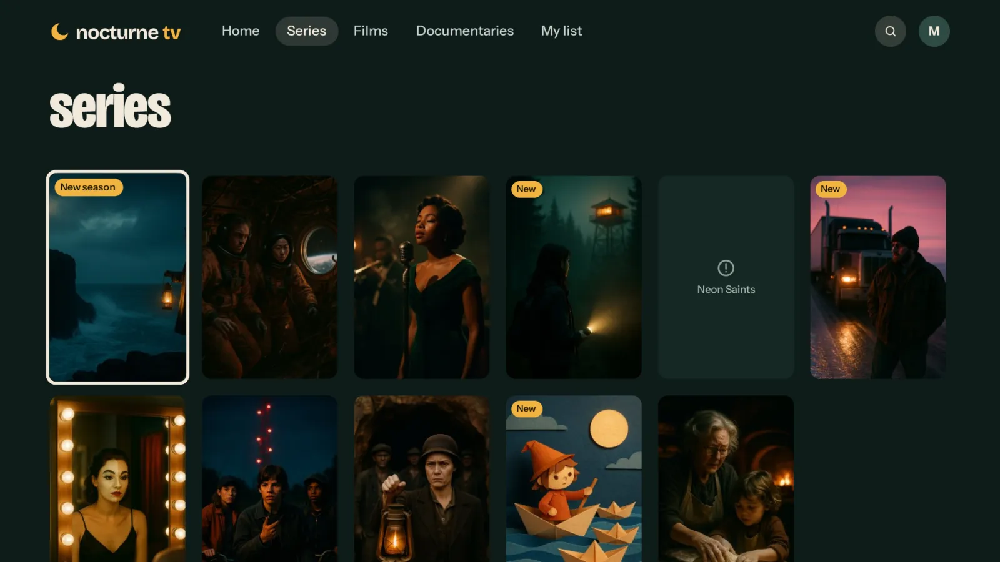
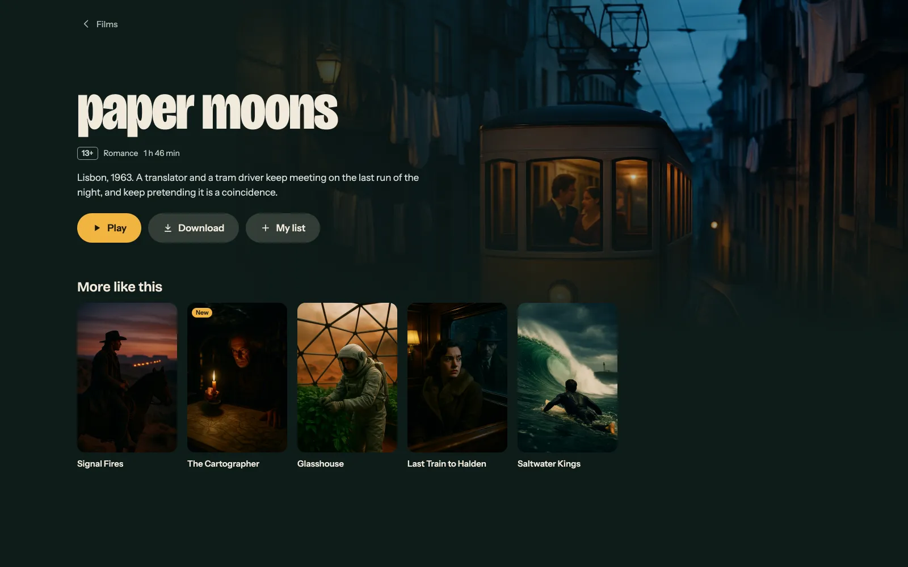
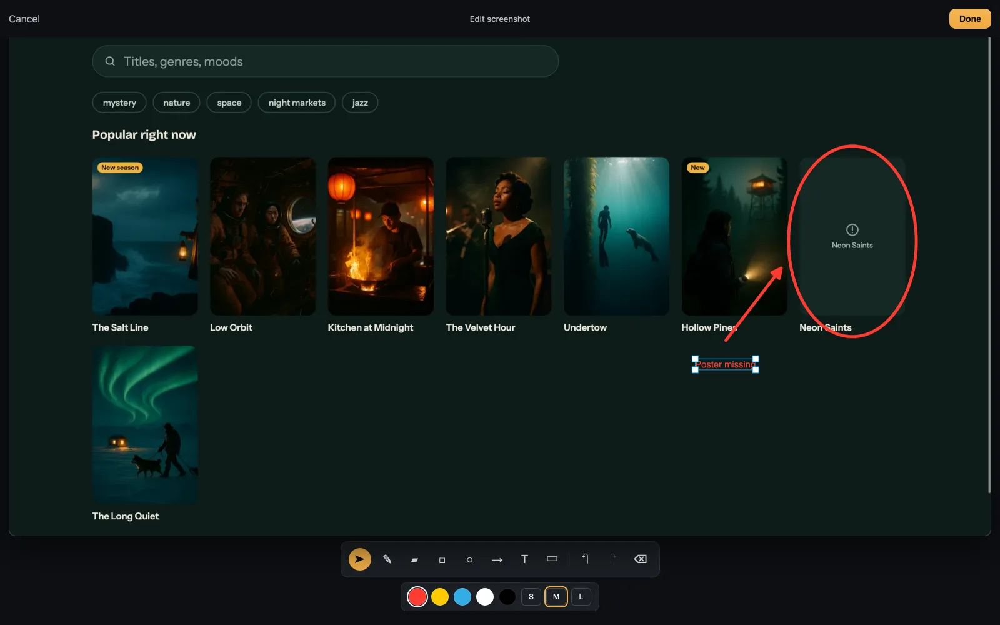
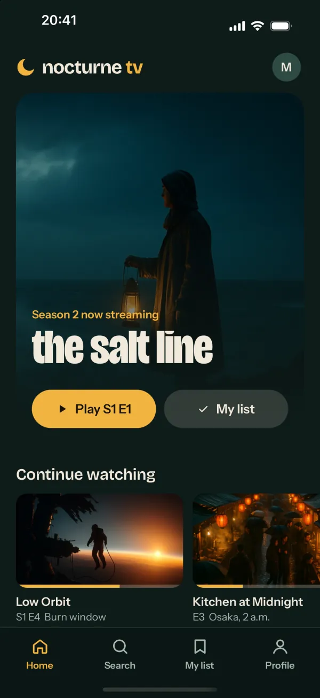
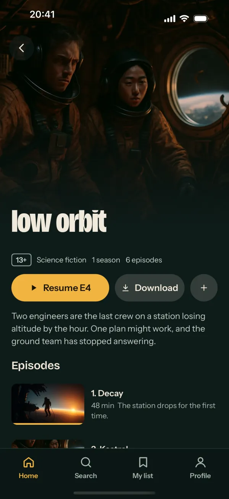
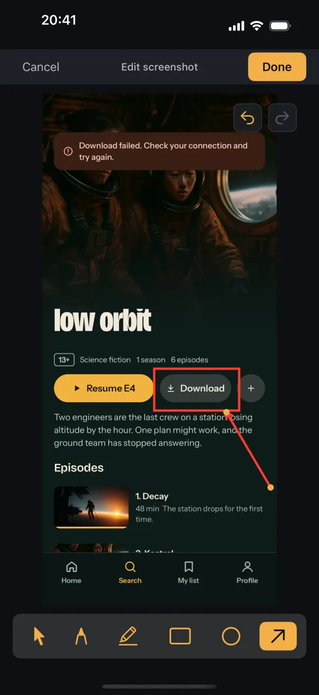

# Everframe OTT demo

Nocturne TV is a made-up streaming service that shows what
[Everframe](https://everframe.dev) captures when a viewer reports a problem.
One React Native codebase runs on:

| Target | Command |
|---|---|
| Apple TV | `pnpm ios:tv` |
| Android TV | `pnpm android:tv` |
| iPhone, iPad | `pnpm ios` |
| Android phones | `pnpm android` |
| Web | `pnpm web` |

It uses [react-native-tvos](https://github.com/react-native-tvos/react-native-tvos)
so TV remotes and focus work, Expo for the native projects, expo-video for
playback and react-native-web for the browser. Everframe comes from the
published [`@everframe/react-native`](https://www.npmjs.com/package/@everframe/react-native)
package.

Everything on screen is original: titles, synopses and people are invented,
the artwork was generated for this app, and the episode clips are slow camera
moves over that artwork. See [NOTICE.md](NOTICE.md).

## Screenshots

**Apple TV**, home and the player with subtitles:





**Android TV**, the series grid (the empty Neon Saints tile is one of the [demo bugs](#demo-bugs)):



**Web**, a film page and a report being annotated:





**iPhone**, home, a series page and the reporter:

<p>
  
  
  
</p>

## Setup

You need Node 20+, pnpm, and the usual React Native toolchain: Xcode with the
tvOS simulator for Apple targets, Android Studio with a phone or TV emulator for
Android.

```sh
pnpm install
cp .env.example .env
```

The app works out of the box: it reports to a public, rate-limited Nocturne TV
demo project on everframe.dev (keys in `src/everframe/keys.ts`).

To see the reports yourself, create a project in Everframe with two
integrations, **React Native** (phones and TVs) and **Web**, and put their SDK
keys in `.env`:

```sh
EXPO_PUBLIC_EVERFRAME_KEY=evf_live_…       # React Native integration
EXPO_PUBLIC_EVERFRAME_WEB_KEY=evf_live_…   # Web integration
```

Keys are read at build time: restart Metro or rebuild after changing them.

## Running

```sh
pnpm web            # http://localhost:8081
pnpm ios            # iPhone simulator
pnpm android        # Android phone emulator
pnpm ios:tv         # Apple TV simulator
pnpm android:tv     # Android TV emulator
```

`ios/` and `android/` are generated by `expo prebuild` and not committed.
Phone and TV builds of the same platform need different native projects, so
switch with `pnpm prebuild` or `pnpm prebuild:tv` before building the other one.

### Release builds for recordings

Debug builds show React Native's yellow log box, and on phones a shake also
opens the developer menu. Record from release builds:

```sh
pnpm ios -- --configuration Release
pnpm android -- --variant release
EXPO_TV=1 pnpm ios:tv -- --configuration Release
EXPO_TV=1 pnpm android:tv -- --variant release
pnpm build:web && npx serve dist
```

## Reporting a bug in the app

Like most consumer apps, Nocturne doesn't float a report button over its
content. The triggers are:

| Platform | Trigger |
|---|---|
| Phone | Shake the phone (Simulator: Device → Shake, or Ctrl+Cmd+Z) |
| Web | Ctrl+Shift+B (Cmd+Shift+B on a Mac) |
| Android TV | The Menu button on the remote |
| Apple TV | Hold Play/Pause: a QR code pairs a phone, and the report is filed from the phone with this screen's context |
| Anywhere | Profile, then Report a problem; or the `nocturne://report` deep link |

Shake is the Everframe SDK's own trigger (`shakeToReport: { enabled: true }`
in `src/everframe/config.ts`); the SDK ignores it on TVs. Don't add an
app-level shake listener as well: one shake would open two reporters, and the
second has an empty capture with no session replay. In debug builds React
Native's developer menu may also appear on shake; record from release builds (see below).

## Demo bugs

Profile has a **Demo bugs** list. Switch one on, reproduce it, then report it:

| Bug | Where | What the report shows |
|---|---|---|
| Subtitles run 2 seconds late | Any episode, subtitles on | Screenshot to annotate, player events |
| A poster fails to load | Neon Saints, in Nocturne originals | Failed request (404) in the network log |
| Search takes 4 seconds | Search | Request timing, a slow-search warning |
| Download throws an error | Download on a series page (phone, web) | Captured exception, console error |
| Playback stalls after 10 seconds | Player | Buffering events, failed segment requests (503) |

The app's "backend" calls go to an httpbin-compatible echo service
(`https://httpbin.org` by default; set `EXPO_PUBLIC_DEMO_API` in `.env` to use
another), so network logs contain real requests.

Other things worth showing:

- The signed-in viewer (Mara Lind) is attached to every report via `setUser`.
- Profile's email and payment rows are wrapped in `EverframeSensitive`, so
  they are redacted in screenshots.
- The player reports session vitals (startup, play, pause, seek, buffering,
  errors) through `useTrackPlayer`; on web the SDK reads them from the
  `<video>` element.
- Every screen is named with `useEverframeScreen`, and navigation leaves
  breadcrumbs.

## Deep links

Handy for recordings: jump straight to a scene instead of navigating to it.

| Link | Opens |
|---|---|
| `nocturne://home`, `series`, `films`, `documentaries`, `search`, `list`, `profile` | That section |
| `nocturne://title/low-orbit` | A series page |
| `nocturne://play/kitchen-midnight/e3` | The player at that episode |
| `nocturne://demo/subtitleDrift/on` (or `all/off`) | Switch demo bugs |
| `nocturne://report` | The Everframe reporter |

```sh
xcrun simctl openurl booted "nocturne://play/kitchen-midnight/e3"
adb shell am start -a android.intent.action.VIEW -d "nocturne://demo/all/on" dev.everframe.nocturne
```

## Regenerating media

```sh
bash scripts/make-clips.sh   # episode clips from assets/images (needs ffmpeg)
```
